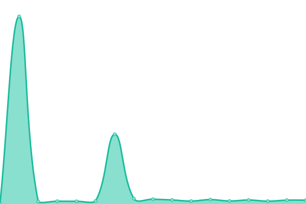

# [📈 Live Status](https://fk-solutions.github.io/monitoring): <!--live status--> **🟧 Partial outage**

This repository contains the open-source uptime monitor and status page for [Fernando León](https://devtocloud.com), powered by [Upptime](https://github.com/upptime/upptime).

With [Upptime](https://upptime.js.org), you can get your own unlimited and free uptime monitor and status page, powered entirely by a GitHub repository. We use [Issues](https://github.com/fk-solutions/monitoring/issues) as incident reports, [Actions](https://github.com/fk-solutions/monitoring/actions) as uptime monitors, and [Pages](https://demo.upptime.js.org) for the status page.

<!--start: status pages-->
<!-- This summary is generated by Upptime (https://github.com/upptime/upptime) -->
<!-- Do not edit this manually, your changes will be overwritten -->
<!-- prettier-ignore -->
| URL | Status | History | Response Time | Uptime |
| --- | ------ | ------- | ------------- | ------ |
|  [AMBSILCloud](https://cloud.ambientesil.com) | 🟩 Up | [ambsil-cloud.yml](https://github.com/FK-Solutions/monitoring/commits/HEAD/history/ambsil-cloud.yml) | 

 901ms
     
 | 

<a href="https://fk-solutions.github.io/monitoring/history/ambsil-cloud">100.00%</a>
    

|  [Ambientes](https://ambientesproductosdelimpieza.com) | 🟩 Up | [ambientes.yml](https://github.com/FK-Solutions/monitoring/commits/HEAD/history/ambientes.yml) | 

 1701ms
     
 | 

<a href="https://fk-solutions.github.io/monitoring/history/ambientes">100.00%</a>
    

|  [AMBSIL](http://ambsil.com.mx) | 🟩 Up | [ambsil.yml](https://github.com/FK-Solutions/monitoring/commits/HEAD/history/ambsil.yml) | 

 405ms
     
 | 

<a href="https://fk-solutions.github.io/monitoring/history/ambsil">100.00%</a>
    

|  [AMBSIL MX](http://ambsil.mx) | 🟩 Up | [ambsil-mx.yml](https://github.com/FK-Solutions/monitoring/commits/HEAD/history/ambsil-mx.yml) | 

 400ms
     
 | 

<a href="https://fk-solutions.github.io/monitoring/history/ambsil-mx">100.00%</a>
    

|  [Macro Pro WS](http://portalmacropro.com.mx/srvCFDi33/service1.asmx) | 🟩 Up | [macro-pro-ws.yml](https://github.com/FK-Solutions/monitoring/commits/HEAD/history/macro-pro-ws.yml) | 

 169ms
     
 | 

<a href="https://fk-solutions.github.io/monitoring/history/macro-pro-ws">98.91%</a>
    

|  [AMBSIL HMO](ambienteshmo.fortiddns.com) | 🟩 Up | [ambsil-hmo.yml](https://github.com/FK-Solutions/monitoring/commits/HEAD/history/ambsil-hmo.yml) | 

 107ms
     
 | 

<a href="https://fk-solutions.github.io/monitoring/history/ambsil-hmo">87.15%</a>
    

|  [Demo Web III](https://demo.org) | 🟥 Down | [demo-web-iii.yml](https://github.com/FK-Solutions/monitoring/commits/HEAD/history/demo-web-iii.yml) | 

 0ms
     
 | 

<a href="https://fk-solutions.github.io/monitoring/history/demo-web-iii">86.01%</a>
    

<!--end: status pages-->

[**Visit our status website →**](https://demo.upptime.js.org)

## 📄 License

- Powered by: [Upptime](https://github.com/upptime/upptime)
- Code: [MIT](./LICENSE) © [Fernando León](https://devtocloud.com)
- Data in the `./history` directory: [Open Database License](https://opendatacommons.org/licenses/odbl/1-0/)
